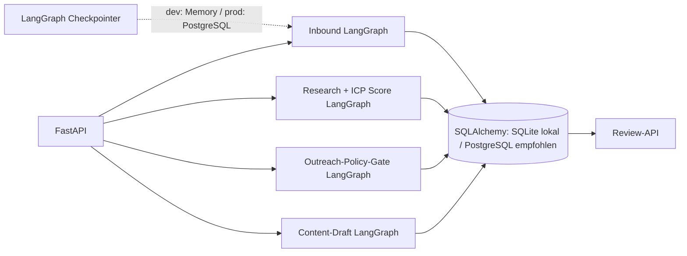

# DACH GTM Agent — LangGraph MVP

Kleines, erweiterbares Backend für die im Konzept beschriebenen DACH-B2B-SaaS-Abläufe. Es bildet **Inbound-Qualifizierung, Account-Research/Scoring, manuelle Outreach-Aufgaben und Content-Entwürfe** als getrennte LangGraph-Workflows ab.

## Sicherheitsgrenzen im MVP

- Es gibt **keinen Versand von E-Mails**, keine automatisierten Anrufe und keine LinkedIn-Aktionen. Die API legt höchstens interne Review-Aufgaben an.
- E-Mail-Aufgaben werden nur bei dokumentierter, aktiver Marketing-Einwilligung angelegt. Eine Anfrage über ein Formular gilt nicht selbst als Marketing-Einwilligung.
- Telefon-Aufgaben sind immer als manuell markiert und erfordern eine gesonderte Einzelfallprüfung. Der Code entscheidet keine mutmaßliche Einwilligung.
- LinkedIn-Aufgaben bleiben manuell. Es gibt keinen Scraper, Browserbot, Nachrichtenversand oder automatisches Liken/Kommentieren.
- Recherche-Signale werden über die API angeliefert; es wird keine Website oder Plattform automatisiert ausgelesen. Fakten, Schlussfolgerungen, Quellen-URL und Vertrauensgrad bleiben getrennt.
- Webseiten und Recherchetexte sind nicht als Anweisungen ausführbar: die MVP-Graphen rufen kein LLM mit solchen Texten auf.
- Die Content-Erstellung ist derzeit ein konservatives, quellengebundenes Textgerüst aus vom Nutzer gelieferten Aussagen, kein freier KI-Fakten-Generator.

Das sind technische Schutzvorkehrungen, keine Rechtsberatung. UWG-/Datenschutzprüfung und Anpassung an den konkreten Prozess bleiben erforderlich.

## Ablauf und Komponenten



Der ICP-Score ist nachvollziehbar und konfigurierbar, aber bewusst kein autonomer Kontaktentscheid. Ohne konkrete ICP-Größenkriterien bleiben Größenwerte neutral/unbegrenzt.

## Starten

Voraussetzungen: Python 3.11+, Abhängigkeiten aus `pyproject.toml` und optional Docker Compose für PostgreSQL.

1. Projekt-Abhängigkeiten mit dem bevorzugten Python-Paketmanager aus `pyproject.toml` einrichten.
2. `.env.example` nach `.env` kopieren und ICP-Grenzen sowie Datenbank-URL prüfen.
3. Lokal mit SQLite und In-Memory-Checkpoints starten:

   ```bash
   uvicorn dach_gtm_agent.api:app --app-dir src --reload --env-file .env
   ```

   Interaktive API-Dokumentation: `http://127.0.0.1:8000/docs`.

Für PostgreSQL in der Entwicklung kann `docker compose up -d postgres` gestartet und in `.env` `DATABASE_URL` sowie `GRAPH_CHECKPOINT_BACKEND=postgres` und `CHECKPOINT_DATABASE_URL` gesetzt werden. SQLite/In-Memory eignet sich nur für lokale Entwicklung. PostgreSQL-Checkpoints speichern den Workflow-Zustand dauerhaft; sie enthalten je nach Workflow auch Eingabedaten. Zugriffe, Verschlüsselung, Löschfristen und Aufbewahrung müssen deshalb mindestens so streng wie für die Lead-Datenbank geregelt werden.

## API-Überblick

### Inbound

`POST /v1/inbound` nimmt Formular-Anfragen an. `Idempotency-Key` als Header verhindert doppelte Verarbeitung bei Wiederholungen. Marketing-Einwilligung ist standardmäßig `false`; falls sie `true` ist, sind exakter Checkbox-Text, Textversion und Erfassungszeitpunkt Pflichtfelder. Der Graph qualifiziert heuristisch und erzeugt eine **interne** Review-Aufgabe.

```json
{
  "company_name": "Beispiel GmbH",
  "company_domain": "https://www.beispiel.de",
  "country": "DE",
  "industry": "B2B SaaS",
  "contact_name": "Mara Beispiel",
  "contact_email": "mara@beispiel.de",
  "contact_role": "VP Sales",
  "request_text": "Wir suchen eine Lösung und möchten eine Demo vereinbaren.",
  "form_source": "website_demo_form",
  "marketing_consent": false
}
```

### Account-Research und erklärbares Scoring

`POST /v1/research/accounts` erwartet Accounts und Belege aus Team-Eingaben oder autorisierten Providern. Pro Signal: Typ, Zusammenfassung, Quell-URL, `fact`/`inference`, Vertrauensgrad und Beobachtungszeit. `GET /v1/accounts/{account_id}` liefert gespeicherte Belege und Teilwerte. Ein Review-Task wird unabhängig vom Score angelegt.

Konfigurationsvariablen: `ICP_TARGET_INDUSTRIES`, `ICP_MIN_EMPLOYEES`, `ICP_MAX_EMPLOYEES`, `ICP_SIGNAL_MAX_AGE_DAYS`.

### Kontaktpflege und Outreach-Aufgaben

- `POST /v1/accounts/{account_id}/contacts`: Kontakt aus einer angegebenen Quelle anlegen. Eine Quelle ist Pflicht.
- `POST /v1/outreach/tasks`: gewünschten Kanal, Begründung, Quell-URL und optionalen Entwurf übergeben.
- `POST /v1/contacts/{contact_id}/suppress`: Kontakt kanalübergreifend sperren.
- `POST /v1/contacts/{contact_id}/email-consent/revoke`: Marketing-E-Mail-Einwilligung widerrufen.
- `POST /v1/review/{activity_id}`: Aufgabe freigeben, bearbeiten, zurückstellen oder „nicht kontaktieren“ markieren.
- `GET /v1/review`: Review-Queue lesen.

Eine Freigabe markiert nur die Aufgabe als freigegeben; sie löst **keine** externe Aktion aus. Eine aktive Sperre blockiert alle Kanäle. Für E-Mail muss ein aktiver Permission-Datensatz vorhanden sein; Telefon bleibt mit `requires_legal_review=true` gesondert prüfpflichtig.

### Content Intelligence

`POST /v1/content/ideas` erzeugt aus Thema, Zielgruppe, vom Autor bereitgestellter Kernaussage, Diskussionsfrage und Quellen ein Review-pflichtiges Textgerüst. `GET /v1/content/ideas` zeigt Entwürfe; `POST /v1/content/ideas/{content_id}/review` kann sie freigeben, bearbeiten oder ablehnen. Auch nach Freigabe wird nichts veröffentlicht.

## Datenmodell

Enthaltene Tabellen: `accounts`, `contacts`, `signals`, `permissions`, `leads`, `activities`, `suppression`, `content_ideas`, `audit_events`. Für einen produktiven Betrieb sollte `create_all` durch versionierte Datenbankmigrationen ersetzt und eine Lösch-/Prüffrist je personenbezogenem Feld festgelegt werden. Audit-Payloads sind absichtlich knapp; keine Secrets in Requests, Prompts oder Logs ablegen.

## Tests

Unit-Tests liegen unter `tests/`. Mit installierter Test-Extra-Abhängigkeit ausführen:

```bash
pytest
```

## Nächste sinnvolle Erweiterungen

1. Migrationen (Alembic), Authentifizierung/Rollen und Rate-Limits ergänzen.
2. Provider-Adapter für zugelassene Websuche/Enrichment anbinden und jeden Provider-Aufruf auditieren.
3. LLM-Adapter für Zusammenfassung und Entwürfe hinzufügen; nur mit strukturierten Quellen, Fakten-/Inferenztrennung, Prompt-Injection-Abwehr und menschlicher Freigabe.
4. Review-Oberfläche, Benachrichtigungen, Löschjobs und Checkpoint-Retention ergänzen.
5. Prozess im kleinen Testsegment messen, bevor Datenvolumen oder Automatisierung erweitert werden.
