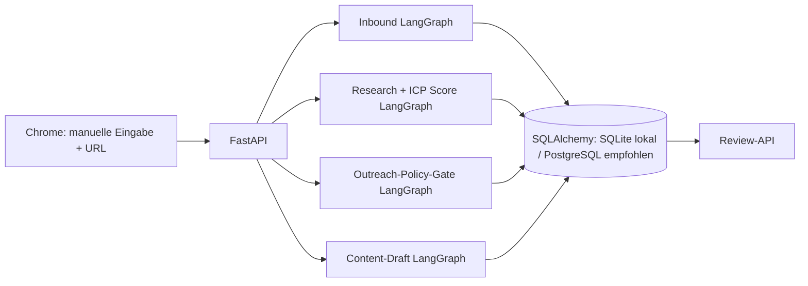

# DACH GTM Agent — LangGraph MVP

Kleines Backend für die DACH-B2B-SaaS-Abläufe aus dem Architekturkonzept. Es implementiert Inbound-Qualifizierung, Account-Research/Scoring, manuelle Outreach-Aufgaben und Content-Entwürfe als LangGraph-Workflows. Ein minimales Chrome-Extension-Popup übergibt **manuell bestätigte** Daten an die lokale API.

## LinkedIn-Grenze und Extension

Die Extension ist absichtlich **kein Apollo-Klon auf technischer Ebene**: Sie liest keine Profilfelder aus dem DOM, kopiert keine LinkedIn-Seitendaten und verwendet keine LinkedIn-Cookies. Nach einem ausdrücklichen Klick übernimmt sie höchstens die URL des aktiven Tabs. Name, Rolle, E-Mail und Telefon werden von der Nutzerin/dem Nutzer selbst eingetragen und vor dem Speichern geprüft. Die Daten landen mit der Profil-URL als Herkunft in der eigenen Datenbank.

Das passt zur LinkedIn User Agreement: diese untersagt nicht autorisierte Browser-Plugins/andere Methoden zum Scrapen oder Kopieren von Profilen und Dienstdaten sowie nicht autorisierte Automatisierung für Kontakt- und Social-Aktionen ([LinkedIn User Agreement](https://www.linkedin.com/legal/user-agreement)). LinkedIn-API-Zugriff auf Member-Daten erfordert passende OAuth-Berechtigungen; viele Berechtigungen und Partnerprogramme müssen ausdrücklich freigeschaltet werden ([LinkedIn API access](https://learn.microsoft.com/en-us/linkedin/shared/authentication/getting-access)). Apollo beschreibt seine Extension als Zugang zu Apollo-Daten und Prospektionsfunktionen in LinkedIn; das erklärt die Produktfunktion, belegt aber nicht, dass eine beliebige Drittanbieter-Extension dieselbe Zugriffsmethode oder Berechtigung hat ([Apollo Extension Overview](https://knowledge.apollo.io/hc/en-us/articles/4409226637453-Apollo-Chrome-Extension-Overview)).

Wenn GTM Delta Lap für euren Anwendungsfall von LinkedIn eine API-/Partnerfreigabe erhält, kann dafür ein OAuth-Provider-Adapter ergänzt werden. Bis dahin bietet diese Extension manuelle URL-Übernahme und Dateneingabe. Sie versendet keine Nachrichten.

### Extension lokal laden

1. API starten und erreichbar halten unter `http://127.0.0.1:8000`.
2. In Chrome `chrome://extensions` öffnen und den Entwicklermodus einschalten.
3. „Entpackte Erweiterung laden“ wählen und den Ordner `extension/` auswählen.
4. LinkedIn-Profil selbst öffnen, Extension anklicken, „Aktive LinkedIn-Profil-URL übernehmen“ drücken.
5. Account/Kontaktfelder selbst prüfen und ergänzen, dann ausdrücklich speichern.

Die Extension hat `activeTab` und Host-Zugriff nur auf den lokalen GTM-Backend-Port. Sie führt auf LinkedIn kein Content-Script aus. Für automatische Profilfeld-Extraktion ist sie bewusst nicht ausgelegt.

## Weitere Sicherheitsgrenzen

- Kein Versand von E-Mails, keine automatisierten Anrufe und keine automatischen LinkedIn-Aktionen. Es werden höchstens interne Review-Aufgaben angelegt.
- E-Mail-Aufgaben werden nur bei dokumentierter, aktiver Marketing-Einwilligung angelegt. Ein Formular-Request allein gilt nicht als Marketing-Einwilligung.
- Telefon-Aufgaben bleiben manuell und erfordern Einzelfallprüfung; der Code entscheidet keine mutmaßliche Einwilligung.
- Recherche-Signale kommen aus Team-Eingaben oder autorisierten Providern. Es wird keine Website oder Plattform automatisch gecrawlt.
- Fakten und Schlussfolgerungen, Quellen-URL, Beobachtungsdatum und Vertrauensgrad sind getrennt.
- Es ist derzeit kein LLM eingebunden. Content-Entwürfe sind ein Quellen-gebundenes Textgerüst aus vom Nutzer gelieferten Aussagen, kein freier KI-Fakten-Generator.

Das sind technische Schutzvorkehrungen, keine Rechtsberatung. UWG-/Datenschutzprüfung und Anpassung an den konkreten Prozess bleiben erforderlich.

## Ablauf und Komponenten



Der ICP-Score ist nachvollziehbar und konfigurierbar, aber kein autonomer Kontaktentscheid. Ohne konkrete ICP-Größenkriterien bleiben Größenwerte neutral/unbegrenzt.

## Backend starten

Voraussetzungen: Python 3.11+, Abhängigkeiten aus `pyproject.toml`, optional Docker Compose für PostgreSQL.

```bash
python -m venv .venv
source .venv/bin/activate
python -m pip install -e ".[test]"
cp .env.example .env
uvicorn dach_gtm_agent.api:app --app-dir src --reload --env-file .env
```

Interaktive API-Dokumentation: `http://127.0.0.1:8000/docs`.

Für PostgreSQL in der Entwicklung: `docker compose up -d postgres`; anschließend `DATABASE_URL`, `GRAPH_CHECKPOINT_BACKEND=postgres` und `CHECKPOINT_DATABASE_URL` in `.env` setzen. SQLite/In-Memory ist nur für lokale Entwicklung. PostgreSQL-Checkpoints speichern Workflow-Zustände dauerhaft; diese können Eingabedaten enthalten und benötigen passende Zugriffs-, Verschlüsselungs- und Löschfristen.

## API-Überblick

- `POST /v1/inbound`: Formularanfrage deduplizieren, heuristisch qualifizieren, interne Review-Aufgabe erzeugen. `Idempotency-Key` schützt vor Duplikaten bei Wiederholungen. Einwilligung erfordert exakten Checkbox-Text, Version und Zeitstempel.
- `POST /v1/research/accounts`: Account und belegte Signale erfassen/scoren.
- `GET /v1/accounts/{account_id}`: Accountscore und Belege lesen.
- `POST /v1/accounts/{account_id}/contacts`: manuell oder aus einer autorisierten Quelle stammenden Kontakt erfassen; Herkunfts-URL ist Pflicht.
- `POST /v1/outreach/tasks`: kanalgeprüfte manuelle Aufgabe erstellen. E-Mail nur mit aktiver dokumentierter Einwilligung; Telefon mit zusätzlicher Rechtsprüfung; LinkedIn nur manuell.
- `POST /v1/contacts/{contact_id}/suppress`: kanalübergreifende Sperre.
- `POST /v1/contacts/{contact_id}/email-consent/revoke`: Marketing-E-Mail-Einwilligung widerrufen.
- `GET /v1/review` und `POST /v1/review/{activity_id}`: Review-Queue und manuelle Freigabe/Bearbeitung.
- `POST /v1/content/ideas`, `GET /v1/content/ideas`, `POST /v1/content/ideas/{content_id}/review`: Content-Entwurf, Review und Freigabe. Auch nach Freigabe wird nichts veröffentlicht.

Eine Freigabe markiert nur die Aufgabe als freigegeben; sie löst keine externe Aktion aus. Eine aktive Sperre blockiert neue Aufgaben über alle Kanäle.

## Datenmodell und Tests

Tabellen: `accounts`, `contacts`, `signals`, `permissions`, `leads`, `activities`, `suppression`, `content_ideas`, `audit_events`. Produktivbetrieb braucht versionierte Datenbankmigrationen, Authentifizierung/Rollen, Rate-Limits, Löschjobs und eine definierte Aufbewahrungsfrist je personenbezogenem Feld. Audit-Payloads sind knapp gehalten; Secrets gehören nicht in Requests, Prompts oder Logs.

Tests liegen unter `tests/`; ausführen mit `pytest`.

## Nächste Erweiterungen

1. Alembic-Migrationen, Authentifizierung/Rollen und Rate-Limits.
2. Adapter zu explizit zugelassenen Websuche-/Enrichment-Providern.
3. Bei erteilter Freigabe: LinkedIn OAuth-Adapter nur für die genehmigten Scopes und Datenfelder.
4. Review-Oberfläche, Benachrichtigungen, Löschjobs und Checkpoint-Retention.
5. Kleine Pilotkohorte messen, bevor Volumen oder Automatisierung erweitert werden.
